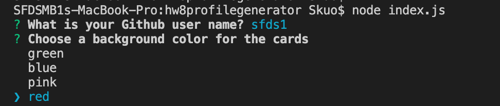

## Name and live url
Stephanie Kuo Week8 - Profile Generator
https://sfds1.github.io/hw8profilegenerator/


## Description
This is a command line application that dynamically generates a PDF profile from a GitHub username.

## What does the app do?
The application  will be invoked with the following command:

```sh
node index.js
```
The PDF will be populated with the following:

* Profile image
* User name
* Links to the following:
  * User location via Google Maps
  * User GitHub profile
  * User blog
* User bio
* Number of public repositories
* Number of followers
* Number of GitHub stars
* Number of users following


## How does it work?
The user will be prompted for their GitHub username and will choose frmo a list of colors, which will be used as the background color for cards.

## Technologies
Node, HTML, CSS, Javascript

## Languages, frameworks, various tools
This application uses Node packages axios, inquirer and html-pdf

## Challenges


## Your experience building this app
This application was fun to build.

## What was difficult
Trying to remember all the right syntax.

## What did you learn
I learned more about node command line interface.

## How did you go about solving a problem


## Screenshot


## Live app, not code



